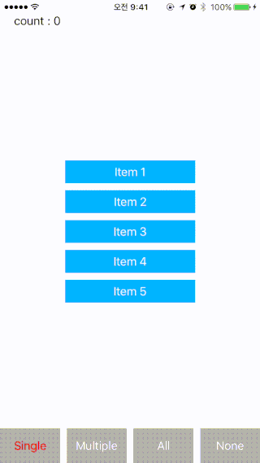

# CPSelectionManager

다수의 UIButton 에서 다중 선택, 하나 선택 가능한 기능을 만들때 쉽게 이용해 보세요.



## Installation

Support only [cocoapods](https://cocoapods.org).

### Podfile

```
pod 'CPSelectionManager'
```

## Usage

### Single selection
```
let selectionManager = CPSelectionManager()
selectionManager.add(control: button1)
selectionManager.add(control: button2)
selectionManager.selectionType = .single
```

### Multi selection
```
let selectionManager = CPSelectionManager()
selectionManager.add(control: button1)
selectionManager.add(control: button2)
selectionManager.selectionType = .multiple
```

### Callback
```
selectionManager.changedSelection = { manager in
    print(manager)
}
```

## License

CPSelectionManager is available under the MIT license. See the LICENSE file for more info.
